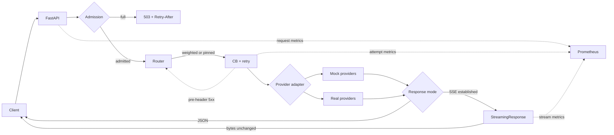

# SRE Inference Gateway

[](https://github.com/crypticseeds/sre-inference-gateway/actions/workflows/ci.yml)

An OpenAI-compatible, multi-provider LLM inference gateway built to demonstrate SRE patterns on AI workloads. It routes non-streaming and SSE chat completions across mock or real backends, fails over before response headers, sheds excess concurrency, and exposes provider-attempt metrics and cost counters. It exists to make the reliability, observability, and cost trade-offs of LLM serving concrete and testable.

## What It Does

- **Byte-faithful SSE passthrough:** flushes each upstream transport chunk immediately without a forwarding buffer, gzip, or byte rewriting; preserves `[DONE]` and forwards `stream_options.include_usage`. Observability retains and parses only a bounded copy of the stream tail after forwarding.
- **Circuit-breaker-aware routing:** combines normalized weighted selection with preferred provider pinning and sequential failover for eligible failures before response headers.
- **Concurrency load shedding:** rejects excess global or per-provider work instead of queueing it, returning `503` with `Retry-After: 1`.
- **Golden-signal metrics:** exports Prometheus traffic, latency, error, saturation, breaker, shed, stream first-byte, and inter-chunk measurements.
- **Server-usage-only cost tracking:** records tokens and configured USD cost only when the provider reports valid usage; it never estimates tokens.
- **Runtime failover drill:** env-gated admin controls fail and restore registered mock providers so breaker transitions and survivor routing can be observed locally.
- **Doppler-first secrets:** real-provider and Grafana Cloud credentials are designed to run through Doppler, with `.env` available only as a local fallback.
- **Zero-key local mode:** two enabled streaming mock providers support complete local requests, usage events, failover, and metrics without credentials.
- **Configurable real adapters:** checked-in configurations cover OpenAI, OpenRouter, Kimi/Moonshot, and RunPod vLLM through OpenAI-compatible adapters, plus unauthenticated local vLLM.
- **Tested integration surface:** the default suite has 187 tests; CI runs Python 3.13, Ruff, and pytest, plus a cross-language Go `llm-slo-bench` integration job on every push and pull request.

## Architecture

The gateway admits work before selecting a circuit-eligible provider. Streaming establishment uses the same resilience and failover path as JSON responses; after headers, bytes flow directly through `StreamingResponse` and cannot switch providers safely.



The local drill uses establishment failures, where HTTP status is still mutable, to demonstrate breaker-driven failover and recovery.


See [Architecture](docs/ARCHITECTURE.md) for exact lifecycle and metric semantics.

## Quickstart

These commands were run in this worktree in the order shown. The checked-in configuration enables only `mock_openai` and `mock_vllm`, so the core path needs no keys, Redis, or Docker.

### 1. Install And Test

```bash
uv sync
uv run pytest -q
```

Expected result: `187 passed, 5 deselected`.

### 2. Start Zero-Key Mode

Run this in a terminal and leave it running for the following checks:

```bash
uv run uvicorn app.main:app --host 127.0.0.1 --port 8000
```

### 3. Smoke Test

```bash
curl -sS http://127.0.0.1:8000/health
curl -sS http://127.0.0.1:8000/v1/health
curl -sS http://127.0.0.1:8000/v1/chat/completions \
  -H 'Content-Type: application/json' \
  -H 'X-Provider-Priority: mock_openai' \
  -d '{"model":"mock-model","messages":[{"role":"user","content":"Say hello briefly."}],"stream":false}'
curl -sS -N http://127.0.0.1:8000/v1/chat/completions \
  -H 'Content-Type: application/json' \
  -H 'X-Provider-Priority: mock_openai' \
  -d '{"model":"mock-model","messages":[{"role":"user","content":"Stream a short greeting with usage."}],"stream":true,"stream_options":{"include_usage":true}}'
```

The health responses include `"status":"healthy"`. The JSON response contains `"Mock OpenAI response for: Say hello briefly."`. The stream contains multiple `data:` events, a final usage object with `"total_tokens":25`, and `data: [DONE]`.

### 4. Run The Failover Drill

Stop the previous process, then start the loopback-only drill server:

```bash
FAILOVER_DRILL_ADMIN=1 uv run uvicorn app.main:app --host 127.0.0.1 --port 8000
```

Fail `mock_openai`, send two pinned requests to reach the checked-in breaker threshold, inspect OPEN state, restore it, wait for the recovery timeout, and send the half-open probe:

```bash
curl -sS -X POST http://127.0.0.1:8000/admin/providers/mock_openai/fail
curl -sS http://127.0.0.1:8000/v1/chat/completions -H 'Content-Type: application/json' -H 'X-Provider-Priority: mock_openai' -d '{"model":"mock-model","messages":[{"role":"user","content":"failure one"}]}'
curl -sS http://127.0.0.1:8000/v1/chat/completions -H 'Content-Type: application/json' -H 'X-Provider-Priority: mock_openai' -d '{"model":"mock-model","messages":[{"role":"user","content":"failure two"}]}'
curl -sS http://127.0.0.1:8000/health/circuit-breakers/mock_openai
curl -sS -X POST http://127.0.0.1:8000/admin/providers/mock_openai/restore
sleep 5
curl -sS http://127.0.0.1:8000/v1/chat/completions -H 'Content-Type: application/json' -H 'X-Provider-Priority: mock_openai' -d '{"model":"mock-model","messages":[{"role":"user","content":"recovery probe"}]}'
curl -sS http://127.0.0.1:8000/health/circuit-breakers/mock_openai
```

The failed legs fall through to `mock_vllm`; the breaker reports `OPEN`, then the successful recovery probe returns it to `CLOSED`. The controls return 404 unless `FAILOVER_DRILL_ADMIN=1`. See the [full drill runbook](docs/failover-drill.md).

### 5. Inspect Metrics

```bash
curl -sS http://127.0.0.1:8000/metrics | grep gateway_
```

This exposes request, failure, duration, stream, in-flight, shed, token, and cost series on the gateway's HTTP port.

### 6. Use Postman

Import `postman_collection.json`. Its folders are **Health & status**, **Chat (mock, no keys)**, **Chat (real providers, pinned)**, **Failover drill**, and **Observability**.

### 7. Test Real Providers With Doppler

This path requires Doppler access and provider credentials:

First set only the selected provider's `enabled` field to `true` in `config.yaml`; provider enablement does not hot-reload into the registry, so start a new process after the edit.

```bash
doppler setup --project sre-inference-gateway --config dev_personal
doppler run -- uv run uvicorn app.main:app --host 127.0.0.1 --port 8000
curl -sS http://127.0.0.1:8000/v1/chat/completions -H 'Content-Type: application/json' -H 'X-Provider-Priority: openrouter' -d '{"model":"openai/gpt-4o-mini","messages":[{"role":"user","content":"Reply with one short sentence."}]}'
```

The pinned request requires a valid configured key. A missing or invalid credential can fail over to a mock and still return HTTP 200, so verify that the body is not a mock response. Follow [Manual testing](docs/manual-testing.md) for the guarded Postman procedure and provider-specific setup.

### 8. Start Monitoring

This target requires Docker and Doppler access to the Grafana Cloud secrets:

```bash
make monitoring-up
```

It renders an ignored mode-`600` Prometheus configuration and starts the remote-write overlay. See [Monitoring](docs/monitoring.md).

### 9. Make Targets

```bash
make test
make dev
```

`make test` runs the normal pytest selection verbosely. `make dev` requires Docker; it starts Redis, Prometheus, and Grafana, waits five seconds, then runs the gateway in the foreground on the host. It does not start vLLM. Use `make dev-stop` to stop that stack.

## Benchmarking: llm-slo-bench

Also check out [llm-slo-bench](https://github.com/crypticseeds/llm-slo-bench), the sibling Go project designed to benchmark this gateway as an OpenAI-compatible target. It measures semantic TTFT at the first non-empty content delta, chunk inter-token latency, SLO gates, and an explicit failure taxonomy. The projects are designed to be run together so gateway-side provider-attempt metrics can be compared with client-observed streaming behavior.

CI runs the cross-language integration test - llm-slo-bench's Go probe against a live gateway - on every push and pull request. The benchmark is checked out directly from its public repository; no secrets are required. The Python lint/test job runs alongside it. Setup details in [Operations](docs/operations.md).

### Benchmark Results

Official joint run, 2026-08-16: llm-slo-bench `fe41627` against gateway `bf319e6`, localhost (macOS), mock-provider lane. The mock emits SSE chunks on a fixed 50 ms cadence with zero keys and zero network, so these numbers isolate gateway overhead rather than any model's inference speed.

| Run | Load | Result | TTFT p50 / p99 | Chunk ITL p50 / p99 |
| --- | --- | --- | --- | --- |
| Ramp | 10s @ 5 rps, 20s @ 10 rps | 175/175 success, 0 errors, 0 drops | 112.4 / 135.9 ms | 50.9 / 54.9 ms |
| Failover drill | 45s @ 8 rps, provider killed at t=12s | 180/180 success, **zero client-visible errors** | 114.6 / 140.4 ms | 51.0 / 61.2 ms |
| Headroom | 30s @ 20 rps | 226/226 started succeeded; 74 dropped by the bench-side admission cap (`max_in_flight=4` in the bench config - not a gateway limit) | 110.3 / 144.6 ms | 50.9 / 59.3 ms |

- SLO gates: p99 semantic TTFT <= 250 ms - **PASS** on every run (worst observed 144.6 ms).
- Failover: the circuit breaker opened ~1.4 s after the kill and re-closed 13.7 s after the kill (1.8 s after the provider was restored); clients saw uninterrupted 200s served by the surviving provider throughout.
- Highest sustained zero-drop stage: 10 rps. Chunk ITL p50 of ~51 ms against the mock's fixed 50 ms cadence puts per-chunk gateway overhead in the ~1 ms band at these rates.
- Semantic TTFT is client-measured (first non-empty content delta) and includes the mock's synthetic first-chunk delays; it is an end-to-end streaming number through the gateway, not a model benchmark.

Full methodology, raw summaries, and the circuit-breaker timeline are published in the llm-slo-bench repository.

## Design Decisions And Limitations

- **No mid-stream provider switchover:** splicing a second provider onto partial output creates ambiguous provenance, duplicate tokens, overlapping cost, and a synthetic benchmark result.
- **Establishment-only breaker accounting:** returning a stream iterator currently records breaker success; a later truncation is metered separately but does not change breaker state.
- **Shed, do not queue:** immediate `503` responses preserve overload visibility and tail latency instead of hiding saturation in an internal queue.
- **Server usage only:** token and cost counters move only for valid provider-reported usage; missing data is marked unpriced rather than estimated.

The rationale and accepted follow-up work are recorded in [Design decisions](docs/design-decisions.md). This is a portfolio and learning system, not a production-ready public gateway: it has no authentication, quota, per-client rate limit, persistent accounting store, or safe post-header failover.

## Roadmap

- Implement the approved mid-stream hardening: terminal in-band error events, sentinel-aware breaker accounting, and an upstream idle timeout.
- Wire configuration reloads to rebuild the provider registry; YAML currently reparses without reliably applying provider changes.
- Add Grafana alerting rules for latency and availability signals; current monitoring provides metrics and dashboards only.
- Add an optional single-manifest Kubernetes demo deployment without presenting it as a production platform.
- Polish request-ID correlation across response headers, logs, and trace views.

## Documentation

| Document | Purpose |
| --- | --- |
| [API dependencies](docs/API_DEPENDENCIES.md) | Request IDs, provider preference, router injection, and tracing dependencies. |
| [Architecture](docs/ARCHITECTURE.md) | Implemented request, routing, streaming, resilience, and metric semantics. |
| [Configuration model API](docs/CONFIG_MODELS_API.md) | Detailed Pydantic configuration model reference. |
| [Configuration model exports](docs/CONFIG_MODELS_EXPORTS.md) | Public configuration module exports and imports. |
| [Configuration model signatures](docs/CONFIG_MODELS_SIGNATURES.md) | Constructor and method signatures for configuration models. |
| [Configuration model summary](docs/CONFIG_MODELS_SUMMARY.md) | Overview and examples for gateway configuration models. |
| [Cost tracking](docs/cost-tracking.md) | Server-usage-only token, pricing, and unpriced-request semantics. |
| [Design](docs/DESIGN.md) | Original project goals, non-goals, and trade-offs. |
| [Design decisions](docs/design-decisions.md) | Current limitations, rejected alternatives, and approved hardening. |
| [Environment](docs/ENVIRONMENT.md) | YAML configuration and environment-variable behavior. |
| [Failover drill](docs/failover-drill.md) | Reproducible mock-provider kill, failover, and recovery procedure. |
| [Health API](docs/HEALTH_API.md) | Health, readiness, provider, and breaker endpoint reference. |
| [Incident](docs/INCIDENT.md) | Sample simulated incident and follow-up analysis. |
| [Load shedding](docs/load-shedding.md) | Immediate concurrency admission, saturation, and tuning. |
| [Manual testing](docs/manual-testing.md) | Doppler, Postman, mock, and pinned real-provider workflow. |
| [Models](docs/MODELS.md) | Request and core Pydantic data-model reference. |
| [Monitoring](docs/monitoring.md) | Prometheus inventory, Grafana Cloud remote write, and dashboard import. |
| [OpenAI adapter API](docs/OPENAI_ADAPTER_API.md) | Detailed OpenAI-compatible adapter API reference. |
| [OpenAI adapter changelog](docs/OPENAI_ADAPTER_CHANGELOG.md) | Historical adapter implementation changes. |
| [OpenAI adapter examples](docs/OPENAI_ADAPTER_EXAMPLES.md) | Adapter usage and integration examples. |
| [OpenAI adapter exports](docs/OPENAI_ADAPTER_EXPORTS.md) | Adapter module exports and import patterns. |
| [OpenAI adapter signatures](docs/OPENAI_ADAPTER_SIGNATURES.md) | Quick-reference adapter signatures. |
| [OpenAI provider summary](docs/OPENAI_PROVIDER_SUMMARY.md) | Implemented OpenAI provider behavior and known limitations. |
| [Operations](docs/operations.md) | Local startup, metrics, CI, and benchmark integration runbook. |
| [Provider factory](docs/PROVIDER_FACTORY.md) | Provider construction architecture and usage. |
| [Provider factory API](docs/PROVIDER_FACTORY_API_REFERENCE.md) | Detailed provider factory API reference. |
| [Provider factory summary](docs/PROVIDER_FACTORY_SUMMARY.md) | Concise provider factory implementation summary. |
| [Providers](docs/PROVIDERS.md) | Provider interface, registry, routing, and implementation guidance. |
| [Real provider adapters](docs/REAL_PROVIDER_ADAPTERS.md) | OpenAI-compatible and vLLM adapter behavior. |
| [Resilience configuration](docs/RESILIENCE_CONFIG.md) | Circuit-breaker and retry configuration reference. |
| [Response models](docs/RESPONSE_MODELS.md) | Chat response and token-usage model reference. |
| [Roadmap](docs/ROADMAP.md) | Historical implementation roadmap and remaining backlog items. |
| [SSE streaming](docs/streaming.md) | Passthrough guarantees, mock streams, failure behavior, and verification. |
| [Configuration tests](docs/TEST_CONFIG.md) | Configuration-manager test coverage. |
| [Real-provider tests](docs/TEST_REAL_PROVIDERS.md) | Real-adapter unit-test scenarios. |
| [Resilience tests](docs/TEST_RESILIENCE.md) | Circuit-breaker and retry test coverage. |
| [vLLM provider tests](docs/TEST_VLLM_PROVIDER.md) | vLLM adapter test notes and examples. |
| [vLLM CPU limitations](docs/VLLM_CPU_LIMITATIONS.md) | Constraints and troubleshooting for CPU-only vLLM. |
| [vLLM Docker setup](docs/VLLM_DOCKER_SETUP.md) | Local Docker vLLM setup and configuration. |

## License

MIT License - see [LICENSE](LICENSE) for details.
