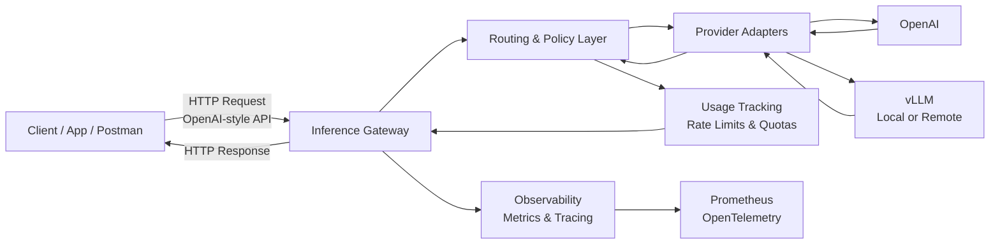
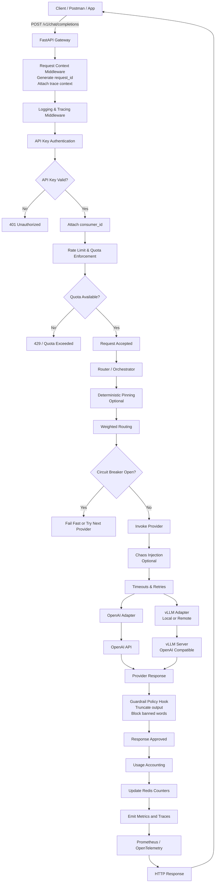

## Request Flow

1. Client sends request to `/v1/chat/completions`
2. API Handler:
   - Validates payload
   - Extracts API key
   - Assigns request ID
3. Auth & Quota Layer:
   - Validates API key
   - Checks Redis rate limits
   - Enforces token budgets
4. Router / Orchestrator:
   - Selects provider (weighted or pinned)
   - Applies retries and timeouts
   - Enforces circuit breakers
   - Applies backpressure if saturated
   - Injects chaos if enabled
   - Applies minimal guardrail policy
5. Provider Adapter:
   - Translates request to provider API
6. Response returned to client
7. Metrics, traces, and logs emitted

## Guardrail / Policy Hook
A minimal operational safety layer:
- Maximum response length
- Banned word filtering
- Demonstrates awareness of safe AI operations
Not intended as content moderation.

## Observability
- Prometheus metrics (latency, errors, saturation, budget burn)
- OpenTelemetry tracing
- Structured logs with request IDs
- No prompt/output logging by default

## Infrastructure
- Dockerized services
- Kubernetes manifests
- Resource limits and HPA
- Redis for runtime state
- Config hot-reload without restart


# FastAPI Middleware Order (Critical)

**Middleware order matters.**  
This is the **correct, intentional order** for your gateway.

```text
┌────────────────────────────────────┐
│ 1. Request ID / Context Middleware │
│    - Generate request_id           │
│    - Attach to context             │
└───────────────┬────────────────────┘
			    ↓
┌────────────────────────────────────┐
│ 2. Logging / Tracing Middleware    │
│    - Start trace/span              │
│    - Structured logging context    │
└───────────────┬────────────────────┘
			    ↓
┌────────────────────────────────────┐
│ 3. API Key Authentication          │
│    - Extract API key               │
│    - Validate key                  │
│    - Attach user_id to request     │
└───────────────┬────────────────────┘
			    ↓
┌────────────────────────────────────┐
│ 4. Rate Limiting / Quotas (Redis)  │
│    - Check request rate            │
│    - Check token budget            │
│    - Fail fast if exceeded         │
└───────────────┬────────────────────┘
			    ↓
┌────────────────────────────────────┐
│ 5. Router / Orchestrator           │
│    - Provider selection            │
│    - Retries / timeouts            │
│    - Circuit breaking              │
│    - Chaos injection               │
│    - Guardrails                    │
└───────────────┬────────────────────┘
			    ↓
┌────────────────────────────────────┐
│ 6. Provider Adapter                │
│    - OpenAI or vLLM call           │
└───────────────┬────────────────────┘
			    ↓
┌────────────────────────────────────┐
│ 7. Response Accounting             │
│    - Token usage increment         │
│    - Metrics emit                  │
└────────────────────────────────────┘
```

**Key rule:**  _Never_ call a provider before auth + quota checks.

### High-Level Inference Gateway Architecture


## How to Explain This Diagram (Blog Copy)

You can paste this explanation directly under the diagram.

### High-Level System Overview

At a high level, the system exposes a **single OpenAI-compatible API** through an inference gateway.

Clients send requests without knowing which model or provider will handle them.  
The gateway applies **routing, policy enforcement, and cost controls**, then forwards the request to one of several inference backends.

Responses flow back through the same gateway, where **usage is tracked** and **metrics are emitted** for operational visibility.

This design:
- Keeps clients simple
- Centralizes reliability and safety logic
- Allows providers to be swapped or scaled independently

### Full-Cycle Architecture Diagram




## How to Explain This Diagram (Blog-Friendly Narrative)

You can literally paste this section under the diagram in your blog.

### 🧠 End-to-End Request Flow Explained

1. **Client Request**
    - A client (Postman, CLI, or app) sends a request to a **single OpenAI-style endpoint**.
    - Clients are unaware of internal routing or providers.
        
2. **Context & Observability**
    - A request ID and trace context are generated immediately.
    - This ensures every log, metric, and trace is correlated.
        
3. **Authentication via API Key**
    - The API key identifies the consumer.
    - No user accounts, no OAuth — this keeps scope tight and testable.
        
4. **Quota & Rate Enforcement**
    - Redis tracks per-key usage.
    - Requests exceeding limits fail **before** hitting any model.
    - This is critical for cost control.
        
5. **Router / Orchestrator**
    - The router is the brain of the system.
    - It applies:
        - Deterministic routing (for debugging)
        - Weighted routing (for canaries)
        - Circuit breaking
        - Timeouts and retries
        - Chaos injection (for testing resilience)

6. **Provider Adapters**
    - Providers are thin translators.
    - They know **how** to call a backend, not **when** or **why**.
        
7. **Inference Execution**
    - Requests go to:
        - OpenAI (external)
        - vLLM (local, OpenAI-compatible)
    - Both are interchangeable from the router’s perspective.
        
8. **Guardrails**
    - A minimal policy layer enforces:
        - Maximum output length
        - Banned words
    - This demonstrates safe AI operations without overreach.
        
9. **Accounting & Cost Awareness**
    - Token usage is estimated and recorded.
    - Enables per-key budgets and metrics.
        
10. **Observability**
    - Metrics, traces, and logs are emitted:
        - Latency
        - Errors
        - Provider health
        - Budget burn

11. **Response**
    - The client receives a clean, OpenAI-compatible response.
    - No provider-specific details leak out.

## 3️⃣ Why This Architecture Is Interview-Strong

You can explicitly say:

“All resilience, cost control, and safety logic lives in the gateway.  
Providers are dumb. Clients are simple.  
The blast radius is contained.”

That sentence alone signals **senior-level platform thinking**.