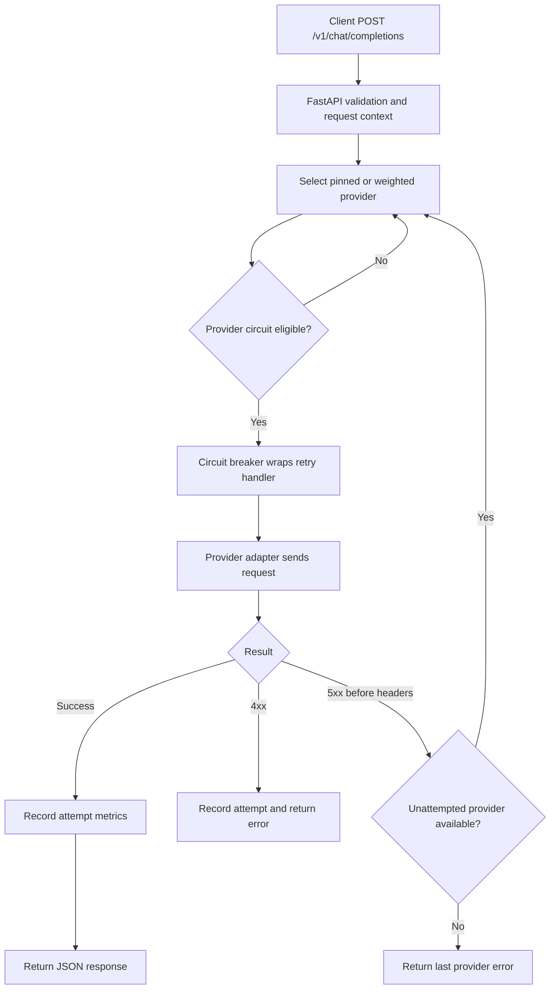
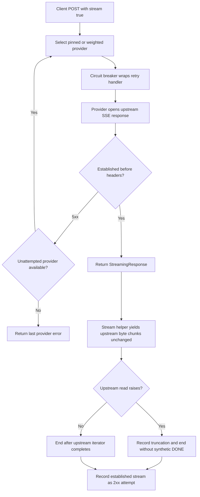

# Architecture

This document describes the implemented gateway. It is not a target-state design.

## Application structure

`app/main.py` creates one FastAPI application. Its lifespan initializes enabled
providers, starts the YAML configuration watcher, and closes both on shutdown.
Startup continues if provider initialization fails so health endpoints remain
available.

The application exposes:

- `POST /v1/chat/completions` for non-streaming and SSE completions.
- `/metrics` and `/v1/metrics` for Prometheus exposition.
- Health and circuit-breaker routes at both root and `/v1` paths.
- Env-gated mock-provider drill routes under `/admin/providers`.

A small HTTP middleware copies the request ID used by the completion dependency
to the `X-Request-ID` response header. FastAPI OpenTelemetry instrumentation is
also installed. There is no authentication, quota, rate-limit, content-filter,
accounting, backpressure, or general chaos-injection layer.

## Providers and registry

`BaseProvider` is an abstract base class. It defines non-streaming completion,
stream establishment, and health-check contracts. OpenAI, vLLM, mock OpenAI, and
mock vLLM adapters implement those contracts.

`ProviderFactory` creates adapters from `config.yaml`. The process-wide
`ProviderRegistry` initializes enabled providers at startup and stores them by
configured name. One provider failing construction does not prevent other
providers from registering.

The configuration file is watched and the parsed configuration can reload, but
the application does not register a callback that rebuilds provider instances.
Provider enablement and adapter configuration therefore require a restart to
take effect reliably.

## Routing and failover

The router normalizes configured nonnegative weights. `X-Provider-Priority` is a
preferred pin: an available, circuit-eligible named provider is tried first. An
unknown, already-attempted, or circuit-ineligible pin falls back to weighted
selection.

Weighted selection excludes providers already attempted for this client request
and providers whose circuit is OPEN and still inside its recovery timeout. If an
OPEN circuit has passed that timeout, routing may select it for a single
HALF_OPEN probe.

Failover is sequential and occurs only before response headers. A provider
`HTTPException` with a 5xx status permits another unattempted provider to be
selected. A 4xx, including 429, is returned without gateway-level failover.
Exceptions from provider operations are translated by the resilience layer into
HTTP errors; resulting 5xx responses may fail over. An exception that escapes
that provider path becomes the endpoint's generic 500. If every attempted
provider returns a 5xx, the last provider error is returned. If no provider can
be selected, the gateway returns 503.

### Non-streaming request flow

```mermaid
flowchart TD
    A[Client POST /v1/chat/completions] --> B[FastAPI validation and request context]
    B --> C[Select pinned or weighted provider]
    C --> D{Provider circuit eligible?}
    D -- No --> C
    D -- Yes --> E[Circuit breaker wraps retry handler]
    E --> F[Provider adapter sends request]
    F --> G{Result}
    G -- Success --> H[Record attempt metrics]
    H --> I[Return JSON response]
    G -- 4xx --> J[Record attempt and return error]
    G -- 5xx before headers --> K{Unattempted provider available?}
    K -- Yes --> C
    K -- No --> L[Return last provider error]
```

### Streaming request flow

```mermaid
flowchart TD
    A[Client POST with stream true] --> B[Select pinned or weighted provider]
    B --> C[Circuit breaker wraps retry handler]
    C --> D[Provider opens upstream SSE response]
    D --> E{Established before headers?}
    E -- 5xx --> F{Unattempted provider available?}
    F -- Yes --> B
    F -- No --> G[Return last provider error]
    E -- Yes --> H[Return StreamingResponse]
    H --> I[Stream helper yields upstream byte chunks unchanged]
    I --> J{Upstream read raises?}
    J -- Yes --> K[Record truncation and end without synthetic DONE]
    J -- No --> L[End after upstream iterator completes]
    K --> M[Record established stream as 2xx attempt]
    L --> M
```

## Resilience

Each public provider operation runs through `execute_with_resilience`. The
circuit breaker wraps the retry handler, so one breaker call contains all outer
retry attempts.

The circuit breaker has three states:

- `CLOSED`: calls run normally. Any success resets the consecutive failure count.
- `OPEN`: routing skips the provider until the recovery timeout elapses.
- `HALF_OPEN`: one recovery probe is allowed. Success closes the circuit. Failure
  reopens it. Concurrent probes fail fast.

The model defaults are five failures and 60 seconds, but checked-in
`config.yaml` deliberately uses a threshold of 2 and a recovery timeout of 5
seconds for the drill. The checked-in outer retry policy uses `max_attempts: 1`.
The retry classifier treats HTTP 5xx, connection errors, timeouts, and explicit
retryable exceptions as retryable. HTTP 4xx and unknown exceptions are not
retried. OpenAI and vLLM adapters also contain provider-local retry behavior.

Status fidelity is partial, not byte-faithful error passthrough. Known
`HTTPException` statuses survive the completion handler, but adapters and the
resilience layer may rewrite error text into FastAPI's `detail` envelope.
Unhandled exceptions return `500 {"detail":"Internal server error"}`.

For streaming, breaker success is recorded when the adapter returns its byte
iterator. Stream consumption happens outside the breaker. Mid-stream failures
therefore do not currently increment breaker failures. See
[design-decisions.md](design-decisions.md#mid-stream-failure) for the accepted
behavior and planned hardening.

## SSE passthrough

Real adapters request `Accept-Encoding: identity`. The application has no gzip
middleware. The downstream response uses `text/event-stream`, `Cache-Control:
no-cache`, and `X-Accel-Buffering: no`.

The shared stream helper iterates `httpx.Response.aiter_bytes()` and yields each
transport chunk immediately. It does not parse JSON, split events, regroup
lines, or rewrite bytes. This preserves multi-line events and the provider's
`data: [DONE]` sentinel. "Per-event flush" here means no application buffering:
the gateway flushes each chunk it receives, which may contain part of one event
or several events depending on upstream transport chunking.

If upstream iteration raises after establishment, the helper logs the failure,
increments `mid_stream_truncation`, closes the upstream response, and ends the
downstream body. It emits neither a synthetic error event nor `[DONE]`.

## Golden signals

Metrics are exposed on the gateway's HTTP port.

| Signal | Metric | Labels | Implemented meaning |
| --- | --- | --- | --- |
| Traffic | `gateway_requests_total` | `provider`, `model`, `stream`, `status_class` | Completed provider attempts. Failover legs count separately. |
| Latency | `gateway_request_duration_seconds` | `provider`, `stream` | Provider-attempt lifetime. Streaming includes iterator lifetime. |
| Time to first byte | `gateway_stream_first_byte_seconds` | `provider` | Time from attempt start to first forwarded chunk. |
| Errors | `gateway_failures_total` | `provider`, `error_type` | `client_4xx`, `establishment`, or `mid_stream_truncation`. |
| Saturation | `gateway_in_flight_requests` | `provider` | Active provider work, including stream iteration. |
| Breaker state | `circuit_breaker_state` | `provider` | `0` CLOSED, `1` OPEN, `2` HALF_OPEN. |

Streaming attempts are recorded as 2xx after establishment even if the iterator
later truncates. The separate `mid_stream_truncation` failure series records that
condition because the HTTP status can no longer change.

## Drill controls

`POST /admin/providers/{name}/fail` and `/restore` change runtime failure state
only for registered mock adapters. Every call checks that
`FAILOVER_DRILL_ADMIN` equals `1`; otherwise the route returns 404. Failure mode
affects new requests during establishment, not streams already in progress.

These endpoints are local drill tooling, not a production control plane. The
complete procedure is in [failover-drill.md](failover-drill.md).
